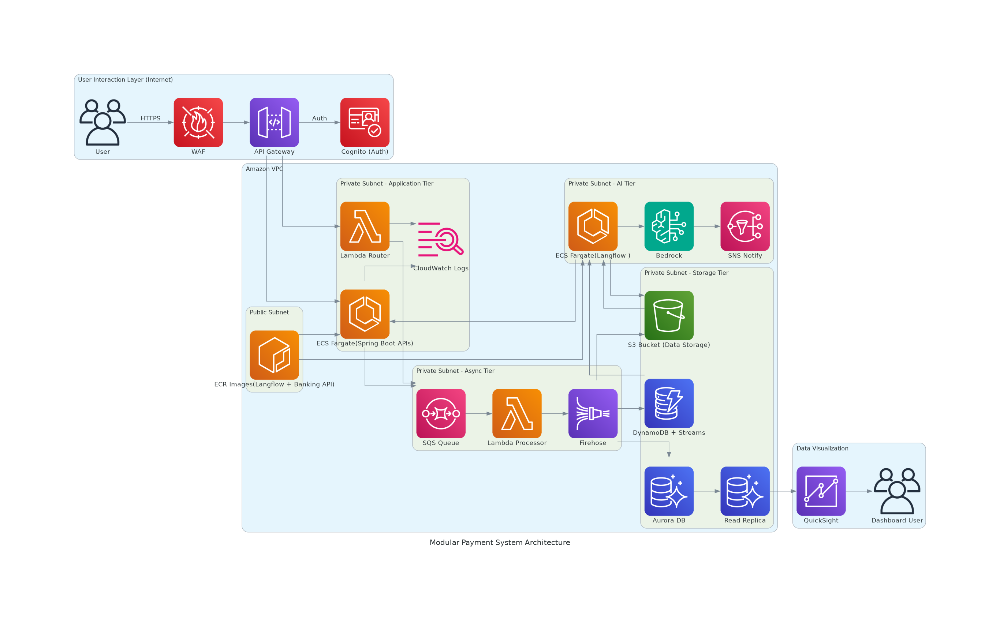

## Architecture Diagram



---

## Modular Payment System - IaC (Terraform)

This repository provides a modular and extensible Infrastructure-as-Code (IaC) implementation using **Terraform** to provision a complete cloud-based payment system. It leverages AWS services, supports isolated modules, and promotes reusability and scalability.

---

## 📁 Directory Structure

```text
.
├── docs/                     # Documentation assets
├── images/                   # Architecture diagrams and related images
├── modules/                  # Independent, reusable Terraform modules
│   ├── analytics/            # Data analytics infrastructure (e.g., Kinesis, Athena)
│   ├── api_gateway/          # API Gateway setup
│   ├── cognito/              # User authentication and identity management
│   ├── database/             # RDS or DynamoDB configurations
│   ├── ecr/                  # Container registry configurations
│   ├── ecs/                  # ECS cluster and Fargate services
│   ├── iam_roles/            # IAM roles and policies
│   ├── lambda/               # Lambda function infrastructure
│   ├── messaging/            # SNS, SQS, and EventBridge configuration
│   ├── monitoring/           # CloudWatch, alarms, logs
│   ├── s3/                   # Object storage configuration
│   ├── security/             # Security groups, WAF, KMS
│   └── vpc/                  # VPC, subnets, routing, NAT, etc.
├── policies/                 # Predefined IAM JSON policy documents
├── scripts/                  # Shell scripts to simplify Terraform workflows
├── main.tf                   # Entry point for the root Terraform configuration
├── outputs.tf                # Global output values
├── terraform.tfvars.example  # Example variables file
├── tfplan                    # Cached Terraform plan (optional)
├── variables.tf              # Global input variables
├── version.tf                # Required Terraform and provider versions
└── README.md                 # Project documentation (this file)
```

---

## 💪 Prerequisites

* [Terraform v1.3+](https://www.terraform.io/downloads)
* AWS CLI configured (`aws configure`)
* Proper AWS IAM permissions to create resources (admin or scoped)

---

## 🚀 Getting Started

### 1. Clone the repository

```bash
git clone https://github.com/hiengyen/modular-payment-system-iac.git 
cd modular-payment-system-iac
```

### 2. Customize Variables

Create a `terraform.tfvars` file based on the provided example:

```bash
cp terraform.tfvars.example terraform.tfvars
```

Edit `terraform.tfvars` to suit your environment and configuration.

---

### 3. Initialize Terraform

```bash
terraform init
```

### 4. Preview Plan

```bash
terraform plan -var-file="terraform.tfvars"
```

### 5. Deploy Infrastructure

```bash
terraform apply -var-file="terraform.tfvars"
```

### 6. Destroy Infrastructure

```bash
terraform destroy -var-file="terraform.tfvars"
```

---

## 🔍 State Management & Resource Inspection

View state:

```bash
terraform show
```

List all resources:

```bash
terraform state list
```

View specific resource:

```bash
terraform state show module.lambda.aws_lambda_function.router
```

---

## 📤 Terraform Outputs

To inspect output values (e.g., API Gateway URL, Lambda ARN):

```bash
terraform output
terraform output api_gateway_url
```

---


